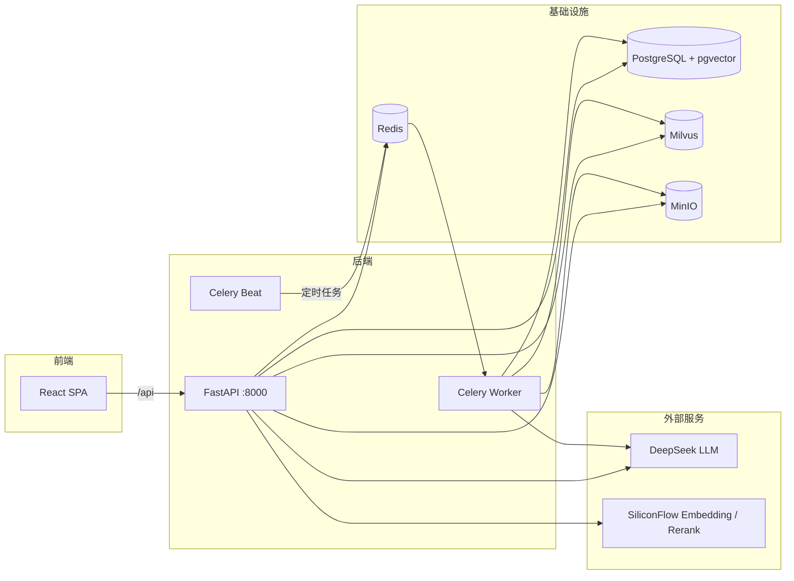

# 知识库管理平台

基于 RAG 的企业级知识库管理与智能问答平台测试项目。支持多格式文档导入解析、向量化检索、Agentic RAG 问答、FAQ 自动挖掘、知识缺口分析与在线测验。

## 功能特性

- **知识管理**:上传 PDF / DOCX / Markdown / TXT 文档,自动解析、分块、向量化入库,支持标签、部门权限管理
- **智能问答 (RAG)**:向量检索 + 重排序 + LangGraph 多节点编排,回答附引用来源
- **FAQ 自动挖掘**:Celery Beat 定时分析用户提问记录,自动生成高频问答对
- **知识缺口分析**:识别知识库无法回答的问题,辅助发现知识盲区
- **在线测验**:基于知识库内容生成题库,支持组卷与在线答题
- **系统管理**:用户 / 角色 / 部门 / 权限管理,JWT 认证
- **仪表盘**:知识量、问答统计等数据可视化

## 技术栈

| 层级 | 技术 |
|------|------|
| 前端 | React 18 + TypeScript + Vite + Zustand + React Router |
| 后端 | FastAPI + SQLAlchemy (async) + Alembic + LangGraph |
| 异步任务 | Celery (Worker + Beat) + Redis |
| 向量数据库 | Milvus 2.4 |
| 关系数据库 | PostgreSQL 15 (pgvector) |
| 对象存储 | MinIO |
| AI 服务 | Embedding (BAAI/bge-m3)、Rerank (BAAI/bge-reranker-v2-m3)、LLM (DeepSeek) |

## 架构



## 项目结构

```
├── kb-backend/          # 后端服务
│   ├── app/
│   │   ├── api/         # 路由:auth/knowledge/rag/faq/gap/quiz/users...
│   │   ├── graphs/      # LangGraph 编排
│   │   ├── nodes/       # 图节点:importer(导入流水线)/ rag
│   │   ├── services/    # 业务服务,含文档解析器(pdf/docx/md/txt)
│   │   ├── tasks/       # Celery 异步任务(FAQ 挖掘等)
│   │   ├── models/      # SQLAlchemy 模型
│   │   └── core/        # 配置、数据库、安全
│   ├── alembic/         # 数据库迁移
│   ├── scripts/         # 初始化脚本
│   └── docker-compose.yml
├── kb-frontend/         # 前端 (React + Vite)
│   └── src/pages/       # 仪表盘/知识管理/智能问答/FAQ/缺口分析/测验/系统管理
└── ocr-server/          # 独立 OCR 服务(可选,用于扫描件解析)
```

## 核心流程实现方式

| 实现方式 | 流程 | 位置 | 说明 |
|----------|------|------|------|
| LangGraph | 智能问答 RAG 链路 | `app/graphs/rag_graph.py` | `StateGraph(RAGState)` + 条件边(FAQ 命中提前退出) |
| LangGraph | 文档导入流水线 | `app/graphs/import_graph.py` | `StateGraph(ImportState)` + 条件路由(校验失败/超限拆分/直通) |
| 直接用服务函数 | 智能出题 | `app/services/quiz_service.py` | 题库命中优先,未命中实时生成,一条直线无需图编排 |

## 服务端口

docker-compose 默认开放的端口:

| 端口 | 服务 | 用途 |
|------|------|------|
| **8000** | **kb-app (FastAPI)** | **应用统一入口:API + API 文档 + 前端静态页面** |
| 5432 | PostgreSQL | 数据库 |
| 6379 | Redis | 缓存 / Celery 消息队列 |
| 19530 | Milvus | 向量数据库 gRPC |
| 9091 | Milvus | 健康检查 / 指标 |
| 9000 | MinIO | 对象存储 API |
| 9001 | MinIO | 管理控制台 |

另有:

| 端口 | 服务 | 用途 |
|------|------|------|
| 8000 | ocr-server | 独立 OCR 推理服务(可选,单独部署;与 kb-app 同端口,注意错开宿主机映射) |
| 5173 | Vite | 前端本地开发热更新(仅本地开发,不涉及服务器部署) |

云服务器部署建议:对外只放行 **8000**(应用入口),5432/6379/19530/9000/9001 等基础设施端口通过安全组限制为内网或本机访问,避免数据库和对象存储直接暴露公网。

## 快速开始

### 环境要求

- Docker + Docker Compose
- Node.js 18+(前端开发)
- 三个 API Key:Embedding、LLM、Rerank(默认使用硅基流动 + DeepSeek)

### 1. 配置环境变量

```bash
cd kb-backend
cp .env.example .env
```

编辑 `.env`,填入必填项:

```ini
EMBEDDING_API_KEY=sk-xxx    # 硅基流动 API Key
LLM_API_KEY=sk-xxx          # DeepSeek API Key
RERANK_API_KEY=sk-xxx       # 硅基流动 API Key
```

### 2. Docker 启动后端及基础设施

```bash
cd kb-backend
docker compose up -d
```

将启动:PostgreSQL、Milvus、MinIO、Redis、FastAPI 应用(`:8000`)、Celery Worker、Celery Beat。

API 文档:http://localhost:8000/docs

### 3. 前端

开发模式(代理到本地 8000 端口):

```bash
cd kb-frontend
npm install
npm run dev        # http://localhost:5173
```

生产部署:

```bash
npm run build      # 产物输出到 dist/
```

将 `dist/` 内容复制到 `kb-backend/app/static/dist/`,由后端统一托管。

### 4. OCR 服务(可选)

扫描件/图片型 PDF 解析需要单独部署 `ocr-server`,并在 `.env` 中设置:

```ini
USE_UNLIMITED_OCR=true
UNLIMITED_OCR_URL=http://<ocr-server地址>
```

## 环境变量说明

| 变量 | 必填 | 说明 | 默认值 |
|------|------|------|--------|
| `EMBEDDING_API_KEY` | 是 | Embedding 服务 API Key | - |
| `LLM_API_KEY` | 是 | LLM 服务 API Key | - |
| `RERANK_API_KEY` | 是 | 重排序服务 API Key | - |
| `EMBEDDING_BASE_URL` | 否 | Embedding 服务地址 | `https://api.siliconflow.cn/v1` |
| `EMBEDDING_MODEL` | 否 | Embedding 模型 | `BAAI/bge-m3` |
| `EMBEDDING_DIM` | 否 | 向量维度 | `1024` |
| `EMBEDDING_LOCAL` | 否 | 是否使用本地 Embedding 模型 | `false` |
| `LLM_BASE_URL` | 否 | LLM 服务地址 | `https://api.deepseek.com` |
| `LLM_MODEL` | 否 | LLM 模型 | `deepseek-v4-flash` |
| `RERANK_MODEL` | 否 | 重排序模型 | `BAAI/bge-reranker-v2-m3` |
| `JWT_SECRET_KEY` | 否 | JWT 签名密钥(生产环境务必修改) | `change-me-in-production` |
| `FAQ_MINING_DAYS` | 否 | FAQ 挖掘回溯天数 | `30` |
| `FAQ_MINING_THRESHOLD` | 否 | FAQ 生成阈值(最少出现次数) | `3` |
| `USE_UNLIMITED_OCR` | 否 | 启用外部 OCR 服务 | `false` |
| `UNLIMITED_OCR_URL` | 否 | OCR 服务地址 | - |

## 常用命令

```bash
# 后端
docker compose logs -f kb-app        # 查看应用日志
docker compose restart kb-worker     # 重启异步任务
alembic upgrade head                 # 数据库迁移(容器内)

# 前端
npm run dev                          # 本地开发
npm run build                        # 生产构建
```

## 待后续开发

以下为尚未完成的工程化事项,声明于此供后续迭代参考。

### P0(优先)

| 事项 | 现状 |
|------|------|
| 修复失败的导入集成测试 | `tests/integration/import_pipeline` 依赖本地基础设施,离线环境跑不通 |
| 主分支 CI 执行完整离线 integration | 当前 CI 仅跑 unit 测试(`.github/workflows/backend.yml`),无 integration job |
| 补齐 alembic.ini 与 migration 校验 | `alembic.ini` 不存在,`alembic/versions/` 为空,建表依赖 `scripts/init_db.sql`,尚无迁移基线 |
| 生产模式禁止默认密钥 | `JWT_SECRET_KEY` 仍默认 `change-me-in-production`,无启动校验拦截 |

### P1(次优)

| 事项 | 现状 |
|------|------|
| 前端 ESLint / Vitest / CI | 前端无 lint 与测试工具链,无前端 CI workflow |
| 拆分 KnowledgeManage 页面 | `index.tsx` 约 1370 行,styles/icons/model 已拆出,主文件仍待拆 |
| 扩大 Ruff / Pyright 覆盖范围 | Ruff 仅启用 4 条正确性规则;Pyright 仅覆盖 9 个文件(basic 模式) |
| 切片/向量化失败状态机与幂等测试 | 导入流水线仅有 happy path 集成测试,失败恢复场景无覆盖 |
| Docker 镜像构建门禁 | CI 无 `docker build` 校验步骤 |

