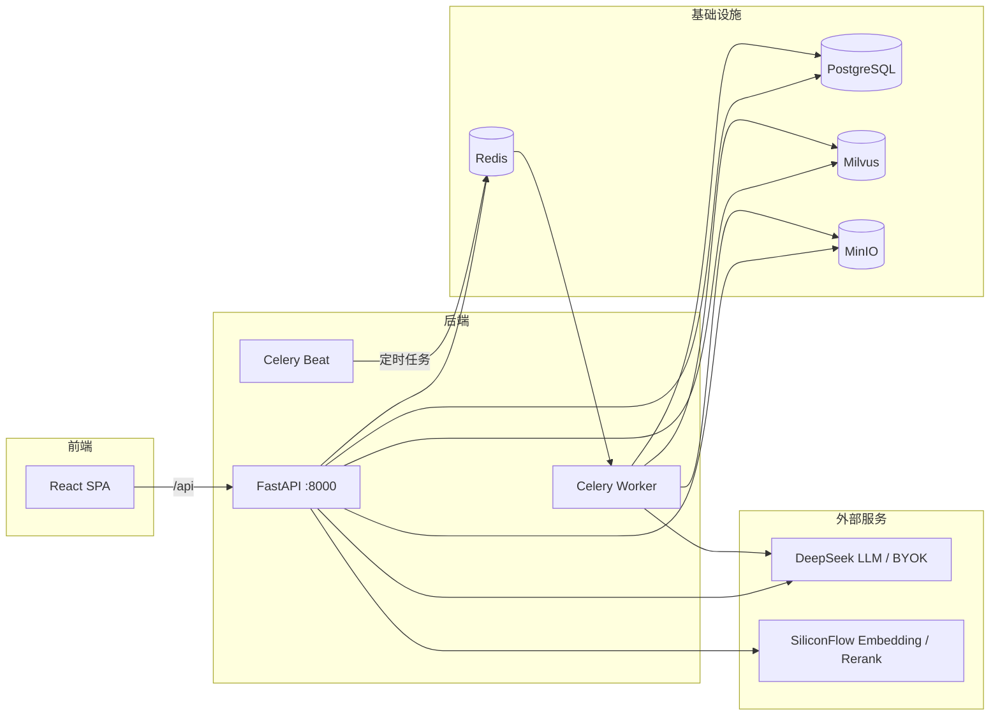

# 知识库管理平台

基于 RAG 的企业级知识库管理与智能问答平台。支持多格式文档导入解析、向量化检索、Agentic RAG 问答、知识点自动提取与审核、FAQ 自动挖掘、题库去重与在线测验、学习掌握度追踪与知识缺口分析。

## 功能特性

- **知识管理**:上传 PDF / DOCX / Markdown / TXT 文档,自动解析、分块、向量化入库,支持标签、四维数据权限(全局/部门/角色/用户)
- **知识点体系(教培版)**:LangGraph 管线从文档自动提取知识点,三层相似度决策(自动合并/合并候选/新建),人工审核后形成知识点图谱
- **智能问答 (RAG)**:FAQ 缓存快路径 + 向量检索 + 重排序 + LangGraph 多节点编排,回答附引用来源
- **在线测验**:出题对齐知识点粒度(LLM 标注 1-3 个知识点),判分自动更新掌握度(mastery_records)
- **题库管理**:两级去重(规范化精确匹配 + 语义相似度),重复扫描与一键合并;用户真实提问挖掘入库
- **FAQ 自动沉淀**:Celery Beat 定时分析用户提问记录,聚类生成高频问答对,发布后进入 Milvus 缓存快路径
- **知识缺口分析**:递归 CTE 追溯知识点前置链,定位学习薄弱根因
- **BYOK 多平台 API Key**:用户自带 DeepSeek/硅基流动/Kimi/智谱/通义/OpenAI 密钥,分级计费
- **系统管理**:教育版四角色(超管/系统管理员/教师/学员),5 项可配置权限码,JWT 认证
- **仪表盘**:知识量、问答统计等数据可视化

## 产品形态

通过 `APP_MODE` 切换,共享核心管线:

| 模式 | 说明 |
|------|------|
| `education` | 教育培训版(当前线上):课程/章节/知识点/掌握度完整体系 |
| `personal` | 个人知识库轻量版:隐藏教育专属模块 |

## 技术栈

| 层级 | 技术 |
|------|------|
| 前端 | React 18 + TypeScript + Vite + Zustand + React Router |
| 后端 | FastAPI + SQLAlchemy (async) + Alembic + LangGraph |
| 异步任务 | Celery (Worker + Beat) + Redis |
| 向量数据库 | Milvus 2.4 |
| 关系数据库 | PostgreSQL 15 |
| 对象存储 | MinIO |
| AI 服务 | Embedding (BAAI/bge-m3)、Rerank (BAAI/bge-reranker-v2-m3)、LLM (DeepSeek,支持 BYOK) |

## 架构



## 项目结构

```
├── kb-backend/          # 后端服务
│   ├── app/
│   │   ├── api/         # 路由:auth/knowledge/rag/quiz/education/org...
│   │   ├── graphs/      # LangGraph 编排:rag/import/point_extraction
│   │   ├── nodes/       # 图节点:importer(导入)/ rag(检索)/ extraction(知识点提取)
│   │   ├── services/    # 业务服务,含文档解析器(pdf/docx/md/txt)
│   │   ├── tasks/       # Celery 异步任务(FAQ 挖掘等)
│   │   ├── models/      # SQLAlchemy 模型(18 张表)
│   │   └── core/        # 配置、数据库、安全、权限
│   ├── alembic/         # 数据库迁移(0001-0011)
│   ├── scripts/         # 初始化脚本
│   ├── tests/           # 88 个测试(unit/integration)
│   └── docker-compose.yml
├── kb-frontend/         # 前端 (React + Vite)
│   └── src/pages/       # 仪表盘/知识管理/智能问答/知识点审核/测验/题库/缺口分析/系统管理/个人设置
└── ocr-server/          # 独立 OCR 服务(可选,用于扫描件解析)
```

## 核心流程实现方式

| 实现方式 | 流程 | 位置 | 说明 |
|----------|------|------|------|
| LangGraph | 智能问答 RAG 链路 | `app/graphs/rag_graph.py` | `StateGraph(RAGState)` + 条件边(FAQ 命中提前退出) |
| LangGraph | 文档导入流水线 | `app/graphs/import_graph.py` | `StateGraph(ImportState)` + 条件路由(校验失败/超限拆分/直通) |
| LangGraph | 知识点提取 | `app/graphs/point_extraction_graph.py` | load → extract ⇄ flush(每 20 chunk 批量)→ finalize,窗口聚合 + 三层相似度决策 |
| 直接用服务函数 | 智能出题/判分 | `app/services/quiz_service.py` | 题库命中优先,实时生成两级去重,判分 upsert 掌握度 |

## 角色与权限

教育版默认角色(启动时自动清理旧角色并迁移用户):

| 角色 | 定位 |
|------|------|
| super_admin | 超级管理员,拥有全部权限 |
| system_admin | 系统管理员 |
| teacher | 教师:知识管理、题库管理 |
| student | 学员:问答、测验 |

`knowledge:read` 与 `ai:access` 对所有登录用户默认开放,无需配置。可配置权限码:

| 权限码 | 说明 |
|--------|------|
| `knowledge:manage` | 知识管理(上传/编辑/删除/标签) |
| `knowledge:manage_permissions` | 数据权限管理 |
| `gap:manage` | 缺口分析 |
| `dashboard:view` | 看板查看 |
| `quiz:manage` | 题库管理 |

## 服务端口

docker-compose 默认开放的端口:

| 端口 | 服务 | 用途 |
|------|------|------|
| **8000** | **kb-app (FastAPI)** | **应用统一入口:API + API 文档 + 前端静态页面** |
| 5432 | PostgreSQL | 数据库 |
| 6379 | Redis | 缓存 / Celery 消息队列 |
| 19530 | Milvus | 向量数据库 gRPC |
| 9091 | Milvus | 健康检查 / 指标 |
| 9000 | MinIO | 对象存储 API |
| 9001 | MinIO | 管理控制台 |

云服务器部署建议:对外只放行 **8000**(应用入口),5432/6379/19530/9000/9001 等基础设施端口通过安全组限制为内网或本机访问。

## 快速开始

### 环境要求

- Docker + Docker Compose
- Node.js 18+(前端开发)
- 三个 API Key:Embedding、LLM、Rerank(默认使用硅基流动 + DeepSeek)

### 1. 配置环境变量

```bash
cd kb-backend
cp .env.example .env
```

编辑 `.env`,填入必填项:

```ini
EMBEDDING_API_KEY=sk-xxx    # 硅基流动 API Key
LLM_API_KEY=sk-xxx          # DeepSeek API Key
RERANK_API_KEY=sk-xxx       # 硅基流动 API Key
```

### 2. Docker 启动后端及基础设施

```bash
cd kb-backend
docker compose up -d
```

将启动:PostgreSQL、Milvus、MinIO、Redis、FastAPI 应用(`:8000`)、Celery Worker、Celery Beat。启动时自动执行 Alembic 迁移(0001-0011)与角色种子初始化。

API 文档:http://localhost:8000/docs

### 3. 前端

开发模式(代理到本地 8000 端口):

```bash
cd kb-frontend
npm install
npm run dev        # http://localhost:5173
```

生产部署:

```bash
npm run build      # 产物输出到 dist/
```

将 `dist/` 内容复制到 `kb-backend/app/static/dist/`,由后端统一托管。

### 4. OCR 服务(可选)

扫描件/图片型 PDF 解析需要单独部署 `ocr-server`,并在 `.env` 中设置:

```ini
USE_UNLIMITED_OCR=true
UNLIMITED_OCR_URL=http://<ocr-server地址>
```

## 环境变量说明

| 变量 | 必填 | 说明 | 默认值 |
|------|------|------|--------|
| `EMBEDDING_API_KEY` | 是 | Embedding 服务 API Key | - |
| `LLM_API_KEY` | 是 | LLM 服务 API Key | - |
| `RERANK_API_KEY` | 是 | 重排序服务 API Key | - |
| `EMBEDDING_BASE_URL` | 否 | Embedding 服务地址 | `https://api.siliconflow.cn/v1` |
| `EMBEDDING_MODEL` | 否 | Embedding 模型 | `BAAI/bge-m3` |
| `EMBEDDING_DIM` | 否 | 向量维度 | `1024` |
| `LLM_BASE_URL` | 否 | LLM 服务地址 | `https://api.deepseek.com` |
| `LLM_MODEL` | 否 | LLM 模型 | `deepseek-v4-flash` |
| `RERANK_MODEL` | 否 | 重排序模型 | `BAAI/bge-reranker-v2-m3` |
| `JWT_SECRET_KEY` | 否 | JWT 签名密钥(生产环境强制 ≥32 字节) | `change-me-in-production` |
| `APP_MODE` | 否 | 产品形态:education / personal | `education` |
| `POINT_REWRITE_INTERVAL` | 否 | 知识点提取 flush 间隔(chunk 数) | `20` |
| `TOPIC_MATCH_THRESHOLD` | 否 | 知识点自动合并相似度阈值 | `0.7` |
| `TOPIC_CANDIDATE_THRESHOLD` | 否 | 合并候选相似度阈值 | `0.5` |
| `FAQ_MINING_DAYS` | 否 | FAQ 挖掘回溯天数 | `30` |
| `FAQ_MINING_THRESHOLD` | 否 | FAQ 生成阈值(最少出现次数) | `3` |
| `USE_UNLIMITED_OCR` | 否 | 启用外部 OCR 服务 | `false` |
| `UNLIMITED_OCR_URL` | 否 | OCR 服务地址 | - |

生产环境启动时会执行安全检查(`_check_production_security`):JWT 密钥与 MinIO 默认密钥不合规直接拒绝启动。

## 常用命令

```bash
# 后端
docker compose logs -f kb-app        # 查看应用日志
docker compose restart kb-worker     # 重启异步任务
alembic upgrade head                 # 数据库迁移(容器内)

# 测试(88 个,含 unit/integration,全部离线运行)
python -m pytest                     # 本地全量
python -m ruff check .               # 静态检查

# 前端
npm run dev                          # 本地开发
npm run build                        # 生产构建
```

## 版本历史

| 标签 | 内容 |
|------|------|
| `v0.3.0` | 教育版角色权限重构、知识点出题闭环、题库两级去重、FAQ 统一并入 quiz 体系 |
| `v0.4.0` | 测试基线扩充至 88 个(知识点提取 21 + 题库服务 18),ruff 全绿 |

## 待后续开发

以下为尚未完成的工程化事项,声明于此供后续迭代参考。

### P1(次优)

| 事项 | 现状 |
|------|------|
| 前端 ESLint / Vitest / CI | 前端无 lint 与测试工具链,无前端 CI workflow |
| 拆分 KnowledgeManage 页面 | `index.tsx` 约 1370 行,styles/icons/model 已拆出,主文件仍待拆 |
| 扩大 Ruff / Pyright 覆盖范围 | Ruff 仅启用 4 条正确性规则;Pyright 仅覆盖 9 个文件(basic 模式) |
| Docker 镜像构建门禁 | CI 无 `docker build` 校验步骤 |
| 多轮对话支持 | 会话历史仅用于前端回放,推理时不含上下文 |
| 检索个性化 | Rerank 无状态,未接入用户掌握度/偏好 |
